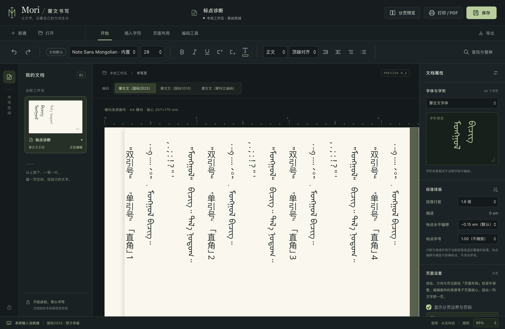

# Mori — 몽골 문자

전통 몽골 문자의 세로쓰기 문서 편집기 (macOS 미리보기).

[English](README.md) · [简体中文](README.zh-CN.md) · [Монгол](README.mn.md) · [Русский](README.ru.md) · [日本語](README.ja.md) · **한국어** · [Deutsch](README.de.md) · [Français](README.fr.md) · [Español](README.es.md)

[](LICENSE)
[](#빌드)

전통 몽골 문자는 **위에서 아래로, 열은 왼쪽에서 오른쪽으로** 씁니다. 그래서 화면은 가로형입니다.
종이는 가로로 펼쳐지고 글자는 세로로 자랍니다.



> **상태: 실행 가능한 개발 미리보기 (v0.2.0).**
> 편집, 시스템 글꼴, 원문 보존, 명시적 인코딩 변환은 동작합니다. 그러나 중국 몽골 문자 국가 표준에
> 대한 **전체 적합성 검증을 통과하지 못했고**, 기업용 입력기의 **실기 검증도 전혀 하지 않았습니다**.
> 완성된 Word 대체품으로 취급하지 마십시오.

---

## 무엇인가

완전히 오프라인으로 동작하는 로컬 Mac 앱입니다. 네트워크 접속 없음, 문서 업로드 없음, 클라우드
서비스 없음, 상용 글꼴이나 입력기를 함께 배포하지 않습니다.

- **네이티브 셸**: Swift + AppKit + WKWebView, 유니버설 바이너리 (Apple Silicon / Intel)
- **편집기**: ProseMirror, `writing-mode: vertical-lr` — 회전으로 흉내 낸 것이 아닌 진짜 세로쓰기
- **변환**: Satsrag/mongol-convert 0.7.1 WASM을 로컬에서 실행
- **대체 글꼴**: Noto Sans Mongolian (SIL OFL 1.1)

## 구현된 기능

### 편집과 조판
- 세로쓰기 서식 있는 텍스트: 위 → 아래, 열은 왼쪽 → 오른쪽. 가로로 이어지는 용지, 확대/축소 지원
- 제목 / 본문 / 글머리 목록, 굵게·기울임·밑줄·글자색
- 실행 취소 / 다시 실행, 찾기 및 모두 바꾸기
- 문서 단위 글꼴, 글자 크기, 줄 간격, 정렬, 여백, 판면 안내선
- 제어 문자 팔레트: FVS(U+180B–180D), MVS(U+180E), NNBSP(U+202F), ZWJ / ZWNJ, 몽골 문자 문장 부호
- 선택 영역의 코드 포인트 실시간 표시(U+XXXX), 문자·단어·사용자 정의 영역 집계

### macOS 네이티브 기능
- AppKit 메뉴 막대, 네이티브 열기 / 저장 패널, 저장하지 않고 종료할 때 확인
- **설치된 모든 글꼴을 열거**하고 몽골 문자 코드 포인트 지원 여부를 판별해, 설치된 몽골 문자 글꼴을 바로 선택할 수 있습니다
- 시스템 입력기의 조합(composition) 생명주기에 연결되어 **조합 중에는 본문을 변경하지 않습니다**
- `.mglx`로 저장 (서식, 글꼴 설정, 가져온 원본 바이트를 함께 보존)
- TXT / HTML 내보내기, 시스템 인쇄 및 PDF로 저장

## 세 가지 인코딩 프로필의 실제 지원 범위

원래 스크린샷의 세 옵션은 서로 다른 **자형과 제어 문자 관습**에 대응합니다. Unicode 버전 번호가
아닙니다.

| 프로필 | 이 버전의 동작 | 아직 미구현 |
| --- | --- | --- |
| 몽골 문자 (국가 표준 2023) | Unicode 원문 편집, FVS / MVS 보존, 선택한 글꼴로 자형화 | GB/T 25914-2023 전체 적합성 |
| 몽골 문자 (국가 표준 2010) | 옛 관습 원문을 그대로 보존. 자모·이형 선택자·접미사 구분자를 다시 쓰지 않음 | 2010 ↔ 2023 자동 이관 |
| 몽골 문자 (Menksoft 인코딩) | 사용자 정의 영역 원문 편집. MenkShape / MenkLetter 변환 미리보기와 사본 내보내기 | 모든 PUA 글꼴 대응표, 무손실 왕복 보장 |

**프로필 전환은 문서 메타데이터만 바꾸며 본문의 코드 포인트는 절대 다시 쓰지 않습니다.** 이는
의도된 설계입니다. 자동 이관은 검증되지 않았고, 조용한 변환은 텍스트를 훼손합니다.

`International 2010` / `International 2023` 명칭에 대하여: 이는 Unicode 버전이 아니라
GB/T 25914-2010과 GB/T 25914-2023 두 국가 표준의 자형 관습을 가리킬 가능성이 큽니다(2023년판이
2010년판을 대체했습니다). 특정 벤더 소프트웨어의 구현 방식은 이 프로젝트에서 확인하지 않았습니다.

### GB18030의 위치

GB18030은 **파일 바이트 인코딩 계층**입니다. 몽골 문자의 명목 문자, 자형 관습, 글꼴 자형화와는
별개의 문제입니다. 가져올 때는 시스템 디코더를 사용하고, 내보내는 텍스트는 항상 UTF-8입니다.

## 변환 안전성

실측 결과: 현재 오픈소스 변환 엔진으로 예시 단어 `ᠮᠣᠩᠭᠣᠯ`을 왕복 변환하면 **명목 자모가 일치하지
않은 채로 돌아옵니다**. 따라서:

- 변환은 **미리보기와 사본만 생성**하며 본문을 대체하지 않습니다
- 변환할 때마다 왕복 검증을 자동 실행하고, 실패하면 명확히 경고합니다
- 엔진이 경고를 내지 않는 것, 자형이 비슷해 보이는 것은 무손실의 증거가 아닙니다

> 몽골 문자 인코딩 변환에는 자형 정규화에 따른 본질적인 정보 손실이 따릅니다.
> **변환 결과로 유일한 원본을 덮어쓰지 마십시오.**

## 빌드

macOS, Apple Command Line Tools, Node.js 22+가 필요합니다.

```bash
npm install
npm run build:web        # web/ 생성 (gitignore 처리됨)
```

네이티브 앱 빌드 스크립트는 기본적으로 프로젝트 상위 디렉터리의 `outputs/`에 출력합니다:

```bash
mkdir -p ../outputs
npm run build:mac        # arm64 + x86_64 컴파일 후 ../outputs/Mori.app 패키징
```

테스트:

```bash
npm test                 # 인코딩 및 문서 무결성 테스트 21개
```

네이티브 UI 자체 점검(선택, 보고서와 스크린샷 생성):

```bash
../outputs/Mori.app/Contents/MacOS/Mori \
  --smoke-test tests/native-results.json \
  --snapshot docs/preview.png
```

### v0.2 추가 사항

- **선택 영역 단위 글꼴과 크기** — 글꼴과 크기 컨트롤이 선택한 텍스트에 적용됩니다. 선택이 없으면 문서 기본값을 바꿉니다.
- **단락과 문자 서식** — H1–H3 제목(⌘0–⌘3), 단락 들여쓰기, 첫 줄 들여쓰기, 단락 줄 간격, 네 가지 정렬, 위첨자와 아래첨자.
- **페이지 설정과 쪽 나눔** — A4/A3, 가로/세로, 여백 프리셋, 읽기 전용 쪽 나눔 미리보기, 쪽이 나뉜 PDF 출력. 쪽 나눔은 블록별 실측으로 계산하므로 큰 제목은 그만큼 더 많은 지면을 차지합니다.
- **DOCX 가져오기와 내보내기** — 로컬에 설치된 LibreOffice를 **별도 프로세스**로 호출합니다. 링크하거나 함께 배포하지 않으므로 GPL-3.0 의무가 이 MIT 프로젝트에 미치지 않습니다. `MORI_SOFFICE`로 경로를 지정할 수 있습니다.

### baosao — 내장 DOCX 엔진

DOCX는 독점 형식이 아니라 몇 개의 XML을 담은 ZIP 컨테이너입니다. **baosao**가 그 패키지를 직접 작성하므로 **DOCX 내보내기가 외부 변환기를 호출하지 않고 LibreOffice도 필요로 하지 않습니다**.

- `src/baosao/zip.js` — 의존성 없는 ZIP 작성기(CRC32 포함). `CompressionStream('deflate-raw')`가 있으면 사용하고 없으면 STORED로 대체
- `src/baosao/ooxml.js` — 문서 모델을 WordprocessingML로: 단락, 제목, 굵게/기울임/밑줄, 색, 글꼴과 크기, 위/아래첨자, 정렬, 들여쓰기와 첫 줄 들여쓰기, 줄 간격, 글머리 목록, 용지 크기와 여백
- `src/baosao/index.js` — 열 개의 파트를 조립하고 **검증**

**몽골 문자의 세로쓰기는 `<w:textDirection w:val="tbLrV"/>`** 로 기록됩니다. 같은 계열의 `tbRl`은 CJK 세로쓰기(열이 오른쪽에서 왼쪽)이며, 혼동을 막는 검사가 있습니다.

내보낼 때마다 검증합니다 — 중앙 디렉터리, 필수 파트, CRC, XML 형식, 세로 방향 — **통과하지 못하면 파일을 쓰지 않습니다**.

> **미검증**: Microsoft의 호환성 문서(MS-OI29500)에 따르면 Word는 표 안에서 `tbLrV`를 90도 회전으로 해석합니다. 파일은 ECMA-376을 따르지만, **Word에서 실제로 어떻게 보이는지는 실제 Word로 확인해야 합니다**.

## 검증 결과

| 항목 | 결과 |
| --- | --- |
| 핵심 테스트 | 59 / 59 통과 |
| 네이티브 편집기 점검 | 75 / 75 통과 |
| 열거한 설치 글꼴 자형 | 557 |
| 몽골 문자 샘플 코드 포인트 지원 글꼴 | 44 |
| 검증한 사용자 정의 영역 코드 포인트 지원 글꼴 | 47 |

포함 범위: Unicode 제어 문자 보존, UTF-8 / UTF-16, GB18030 샘플, 잘못된 입력 거부, 문서 직렬화와
버전 검증, 코드 포인트 통계, 변환 왕복 경고, 실행 취소 / 다시 실행, 인라인 서식을 넘는 검색,
입력기 확정 키 보호, 네이티브 글꼴 열거, 격리된 복구 사본 다시 읽기.

**이 테스트는 표준 인증도, 입력기 인증도 아닙니다.** 자세한 내용은
[`tests/native-results.json`](tests/native-results.json)과 [`tests/core-results.json`](tests/core-results.json)을 참고하십시오.

## 알려진 제한 사항

- **입력기**: 표준 조합 연결은 구현했지만, Menksoft와 각종 기업용 몽골 문자 입력기는 벤더와 버전별로
  실기 검증이 필요합니다. Windows 입력기는 인코딩 어댑터를 추가한다고 해서 macOS에서 바로 동작하지 않습니다.
- **Word 기능**: 표, 이미지, 머리글/바닥글, 쪽 번호, 각주, 변경 내용 추적, 메모가 없습니다. 쪽 나눔은 읽기 전용 미리보기이며 쪽 안에서 직접 편집하는 방식이 아닙니다.
- **쪽 나눔과 PDF**: 블록별 실측을 통한 쪽 나눔과 쪽이 나뉜 PDF 출력을 구현했습니다. 한 쪽에 들어가지 않는 긴 단락은 나뉘지 않고 단독 쪽이 되며 잘림 가능성을 경고합니다. PDF의 자형 단위 재현성은 여전히 미검증입니다.
- **문자 체계 범위**: 토도, 시버, 만주 문자의 완전한 변환은 검증 범위 밖입니다.
- **복구 사본**: 최근 작업 공간만 보관합니다(`~/Library/Application Support/Mori/draft.mglx`). 버전 기록이 아닙니다.
- **플랫폼 검증**: Apple Silicon에서만 실기 테스트했습니다. Intel과 구버전 macOS는 미검증입니다.
- **서명**: 로컬 임시 서명만 되어 있고 **Apple Developer ID 서명과 공증은 하지 않았습니다**. 다른 Mac에서
  처음 열 때 보안 경고가 표시될 수 있습니다.

## 저장소 구조

```
src/        편집기 (HTML / CSS / ProseMirror 로직 / 인코딩 코어)
native/     Swift 네이티브 셸, Info.plist, 빌드 스크립트
vendor/     오프라인 변환 엔진(WASM)과 대체 글꼴
tests/      자동 테스트와 결과 증거
docs/       스크린샷과 릴리스 노트
LICENSE     MIT 라이선스 전문
THIRD-PARTY-NOTICES.md  제3자 라이선스와 글꼴 권리 경계
build.cjs   web 번들 스크립트
```

## 제3자 구성 요소

| 구성 요소 | 라이선스 | 비고 |
| --- | --- | --- |
| [ProseMirror](https://github.com/ProseMirror/prosemirror-view) | MIT | 서식 있는 텍스트 편집 엔진 |
| [Satsrag/mongol-convert 0.7.1](https://github.com/Satsrag/mongol-convert/tree/v0.7.1) | Apache-2.0 | 로컬 WASM 인코딩 변환, mongol-norm 정규화 백엔드 포함 |
| [Noto Sans Mongolian](https://github.com/google/fonts/tree/main/ofl/notosansmongolian) | SIL OFL 1.1 | 대체 글꼴 |

라이선스 전문은 [`vendor/`](vendor)와 [`THIRD-PARTY-NOTICES.md`](THIRD-PARTY-NOTICES.md)에 있습니다.
빌드 시 `web/THIRD-PARTY-NOTICES.txt`가 자동 생성됩니다.

**상용 글꼴(설치된 Menk / Menksoft 계열 등)은 복제하거나 함께 배포하지 않습니다.** 실행할 때 시스템이
이름으로 불러올 뿐입니다.

### 표준 참고 자료

- [GB/T 25914-2023](https://std.samr.gov.cn/gb/search/gbDetailed?id=0B4529DE108FFCAFE06397BE0A0A46CC) — 전통 몽골 문자의 명목 문자, 표시 형식, 제어 문자 사용 규칙. 2010년판을 대체
- [Unicode 사용자 정의 영역 설명](https://www.unicode.org/faq/private_use.html)
- [Unicode Standard §13.5](https://www.unicode.org/versions/Unicode17.0.0/core-spec/chapter-13/) — 몽골 문자. U+180E와 U+202F의 변천 포함

## 라이선스

이 프로젝트의 자체 코드는 **MIT 라이선스**로 배포됩니다. 전문은 [`LICENSE`](LICENSE)를 참고하십시오.

즉, 저작권과 라이선스 고지만 유지하면 이 코드를 자유롭게 사용, 수정, 배포, 상업적으로 이용할 수
있습니다. `vendor/` 아래 제3자 구성 요소는 각자의 라이선스(MIT / Apache-2.0 / OFL 1.1)를 따릅니다.
자세한 내용은 [`THIRD-PARTY-NOTICES.md`](THIRD-PARTY-NOTICES.md)를 참고하십시오.

유의할 경계:

- **상용 몽골 문자 글꼴은 배포 범위에 포함되지 않습니다.** 설치된 Menk / Menksoft 등의 글꼴은 실행할
  때 시스템이 이름으로 불러올 뿐이며, 그 허락은 글꼴 제작사와 별도로 합의할 사항입니다. 이 프로젝트는
  어떠한 글꼴 권리도 부여하지 않습니다.
- 이 프로젝트는 **표준 적합성 인증을 받지 않았고**, MIT도 어떠한 보증도 제공하지 않습니다. 정식 출판이나
  상업적 조판에 사용하기 전에 자형과 쪽 나눔 검증을 직접 수행하십시오.

## 로드맵

- [ ] 2010 ↔ 2023 자형 관습 이관과 회귀 테스트
- [ ] GB/T 25914-2023 전체 적합성 검증
- [ ] 특정 기업용 입력기 실기 검증
- [x] 긴 문서 자동 쪽 나눔과 PDF 자형 재현성
- [x] DOCX 가져오기와 내보내기
- [ ] 문서 버전 기록

## 기여

이 프로젝트가 유용하다면 가장 가치 있는 기여는 **실제 테스트 데이터**입니다. 사용하시는 입력기의 이름과
버전, 그리고 인코딩별로 공개 가능한 작은 샘플 3–5개를 제공해 주시면 큰 도움이 됩니다. 인코딩 호환성
문제는 실제 데이터로만 해결할 수 있습니다.
